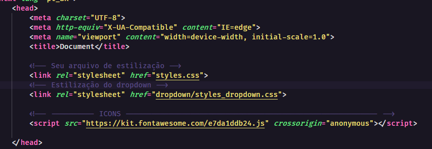
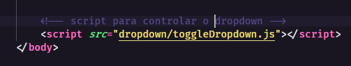

Configuração e instalação:

    Basta copiar a pasta dropdown para a raiz do seu projeto, os outros arquivos não são necessários para
    configuração do dropdown. Caso deseje escolher outro local para colocá-la, altere os paths de importação sugeridos
    nesta documentação.

Dependencias:

    - FontAwesome

    para importar, basta ,no head do seu documento html, colocar a seguinte configuração:

    <script src="https://kit.fontawesome.com/e7da1ddb24.js" crossorigin="anonymous"></script>
    qualquer dúvida quanto à lib, acesse a documentação: https://fontawesome.com/
    

Importação:

    Após os arquivos de estilizações do seu projeto, importe o arquivo styles_dropdown:
    

    no final da tag body, importe o arquivo toggleDropdown.js:
    
     

Para pleno funcionamento, é necessário fazer o seguinte reset no seu arquivo de estilos.

```css
* {
    margin: 0;
    padding: 0;
}
```

para trocar as cores basta acessar o arquivo styles_dropdown.css e alterar a cor desejada no seletor :root
```css
:root {
    --header-background-color: #fff; /*cor do background do header*/
   
    --link-web-color: #4e4e4e; /*cor do link na versão web*/
    --link-web-color-hover: #007e83; /*cor do link no evento de hover na versão web*/
   
    --link-dropdown-color: #fff; /*cor do link quando o menu dropdown for aberto*/
    --link-dropdown-hover-color: #fff; /*cor do link no evento hover quando o menu dropdown for aberto*/
   
    --icon-menu-color: #007e83; /*cor do icone hamburguer(icon-menu) */
    --icon-close-color:#fff; /*cor do icone X(icon-close) obs: so aparece quando abrir o dropdown */
   
    --background-dropdown-color: #007e83;  /*cor do background do menu dropdown quando for aberto*/
}
```
para conseguir utilizar o menu dropdown, é necessário seguir a estrutura:

```html
<header class="header-menu">
    <nav class="container-menu">
        <!-- logo do seu menu -->
        <div>
            Logo
        </div>

        <!-- menu com os links -->
        <div class="menu">
            <ul>
                <li><a class="dropdown-link"href="#">HOME</a></li>
                <li><a class="dropdown-link"href="#">SOBRE</a></li>
                <li><a class="dropdown-link"href="#">CONTATOS</a></li>
                <li><a class="dropdown-link"href="#">PRODUTOS</a></li>
                <li><a class="dropdown-link"href="#">NOVIDADES</a></li>
            </ul>
        </div>

        <!-- icones para abrir e fechar o menu -->
        <div class="icon toggle icon-menu">
            <i class="fas fa-bars"></i>
        </div>
        <div class="icon toggle icon-close">
            <i class="fas fa-times"></i>
        </div>
    </nav>
</header>
```
Caso deseje customizar, basta alterar o arquivo de estilização dropdown/styles_dropdown.css

Qualquer dúvida ou sujestão de melhoria, por favor envie-me no meu email: jvc.goncalves@discente.ufma.br